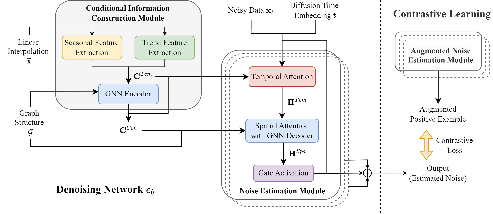
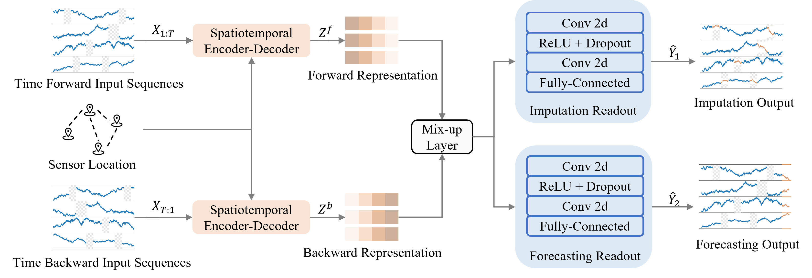








# 🙋‍♀️ About Me

Dr. Yakun Chen is currently a Postdoctoral Research Fellow of Centre for Learning, Teaching, and Technology ([LTTC](https://lttc.eduhk.hk/)) at The Education University of Hong Kong (EdUHK), in collaboration with [Prof. Guandong Xu](https://www.eduhk.hk/en/experts/professor-xu-guandong). She received her Ph.D. degree at the School of Computer Science, Faculty of Engineering and Information Technology, University of Technology Sydney (UTS) (2021-2025), under the supervision of [Dr. Xianzhi Wang](https://profiles.uts.edu.au/XIANZHI.WANG/about), [Prof. Guandong Xu](https://www.eduhk.hk/en/experts/professor-xu-guandong), and [A/Prof. Guodong Long](https://profiles.uts.edu.au/Guodong.Long/about). Before that, she received her Master of Science degree in Applied Mathematics from Northeastern University, USA (2019-2021) and Bachelor of Science degree in Information and Computing Science from Zhejiang Gongshang University (2015-2019). She has published several papers in leading conferences and journals, such as WWW, CSUR, EAAI, and NCA. Additionally, she serves as a reviewer for prominent journals and conferences, including TNNLS, TCSS, ACM TIST, WWW, SIGIR, and IJCAI.

<!-- My research interest includes neural machine translation and computer vision. I have published more than 100 papers at the top international AI conferences with total <a href='https://scholar.google.com/citations?user=DhtAFkwAAAAJ'>google scholar citations <strong>260000+</strong></a> (You can also use google scholar badge ). -->

# 📚 Research Interests
Data Mining, Multivariate Time Series Analysis, Large Language Models Application, I currently focus on:

- LLM based Multi-Agent Systems with Education application.

Welcome to collaborations, feel free to drop me an email!

# 🔥 News
- *Aug 2025*: &nbsp; Honored to serve as Finance Chair at [BESC 2025](https://besc-conf.org/2025/conference-committee).
- *Aug 2025*: &nbsp; One paper has been accepted by CAAI Transactions on Intelligence Technology.
- *Jul 2025*: &nbsp; One paper has been accepted by ECML PKDD 2025 (Journal Track).
- *Jul 2025*: &nbsp; Successfully completed my Ph.D. degree in Computer Science at the University of Technology Sydney. 🎉🎉 
- *Apr 2025*: &nbsp; Will join EduHK as a Postdoctoral Research Fellow.
- *Jan 2025*: &nbsp; One co-authored paper has been accepted by WWW 2025.

# 📝 Publications
## First Author

<!-- ######################################################### -->

**Large language models are few-shot multivariate time series classifiers**

*Data Mining and Knowledge Discovery, 2025*

**Yakun Chen**, Zihao Li, Chao Yang, Xianzhi Wang, Guandong Xu

[Paper](https://link.springer.com/article/10.1007/s10618-025-01145-z) | [Code](https://github.com/junekchen/llm-fewshot-mtsc) | [BibTex](collections/2025_ECML/bibtex.md) 
<!-- <strong></strong> -->

<!-- ######################################################### -->

**A Temporally Disentangled Contrastive Diffusion Model for Spatiotemporal Imputation**

*CAAI Transactions on Intelligence Technology, 2025*

**Yakun Chen**, Kaize Shi, Zhangkai Wu, Juan Chen, Xianzhi Wang, Julian McAuley, Guandong Xu, Shui Yu

[Paper](https://arxiv.org/abs/2402.11558) | [Code](https://github.com/junekchen/C2TSD) | [BibTex](collections/2025_CAAI/bibtex.md) 
<!-- <strong></strong> -->

<!-- ######################################################### -->

**Exploring explicit and implicit graph learning for multivariate time series imputation**

*Engineering Applications of Artificial Intelligence, 2024*

**Yakun Chen**, Ruotong Hu, Zihao Li, Chao Yang, Xianzhi Wang, Guodong Long, Guandong Xu

[Paper](https://drive.google.com/file/d/14R_zrR7pYqq_JCOgOooRaZCHCsx35ZoC/view) | [BibTex](collections/2024_EAAI/bibtex.md) 
<!-- <strong></strong> -->

<!-- ######################################################### -->

**MTSTI: A multi-task learning framework for spatiotemporal imputation**

*International Conference on Neural Information Processing (**ADMA**), 2023*

**Yakun Chen**, Zihao Li, Chao Yang, Xianzhi Wang, Guodong Long, Guandong Xu

[Paper](https://link.springer.com/chapter/10.1007/978-3-031-46677-9_13) | [BibTex](collections/2023_ADMA/bibtex.md) 
<!-- <strong></strong> -->

<!-- ######################################################### -->

**Adaptive graph recurrent network for multivariate time series imputation**

*International Conference on Neural Information Processing (**ICONIP**), 2022*

**Yakun Chen**, Zihao Li, Chao Yang, Xianzhi Wang, Guodong Long, Guandong Xu

[Paper](https://opus.lib.uts.edu.au/bitstream/10453/163519/2/ICONIP_2022_Adaptive_Graph_Recurrent_Network_for_Multivariate_Time_Series_Imputation.pdf) | [BibTex](collections/2022_ICONIP/bibtex.md) 
<!-- <strong></strong> -->

<!-- ######################################################### -->

## Co Author
Coming Soon.

# 🌐 Professional Activities
## Conference Chair
- BESC25 Finance Chair

## Conference Program Committee Member
- BESC25, PKAW25, PKAW24, PRICAI24, PRICAI23, PRICAI22

## Reviewer
### Journal
- IEEE Transactions on Knowledge and Data Engineering (TKDE)
- IEEE Transactions on Neural Networks and Learning Systems (TNNLS)
- IEEE Transactions on Computational Social Systems (TCSS)
- ACM Transactions on Intelligent Systems and Technology (TIST)
- IEEE Access
### Conference
- SIGIR25

# 🌟 Honors and Awards
- UTS HDR WiEIT Award Distinction, 2023.
- UTS 1st Place Winner of Poster Presentations, SoCS HDR Showcase, 2023.
- UTS Faculty of Engineering and Information Technology (FEIT) Scholarship, 2021.
- UTS International Research Scholarship, 2021.

# 📖 Teaching
## Academic Tutor in UTS
- **32516** Internet Programming, Autumn 2024.
- **31748** Programming on the Internet, Autumn 2024.
- **32571** Enterprise Software Testing, Spring 2023.
- **31282** Systems Testing and Quality Management, Spring 2023.
- **32516** Internet Programming, Autumn 2023.
- **31748** Programming on the Internet, Autumn 2023.
- **48024** Application Programming, Spring 2022.

# 💻 Internships
- *Jul 2024 - Jan 2025*, Data Scientist, Lumachain, Sydney, Australia.
- *Dec 2021 - Apr 2022*, Algorithm Engineer, Bytedance, Beijing, China.
- *Mar 2021 - Jun 2021*, Data Analyst, Bytedance, Beijing, China.
- *Jul 2020 - Dec 2020*, Statistical Programmer, Bluebird Bio, Boston, USA.

Last Update: Aug 2025

